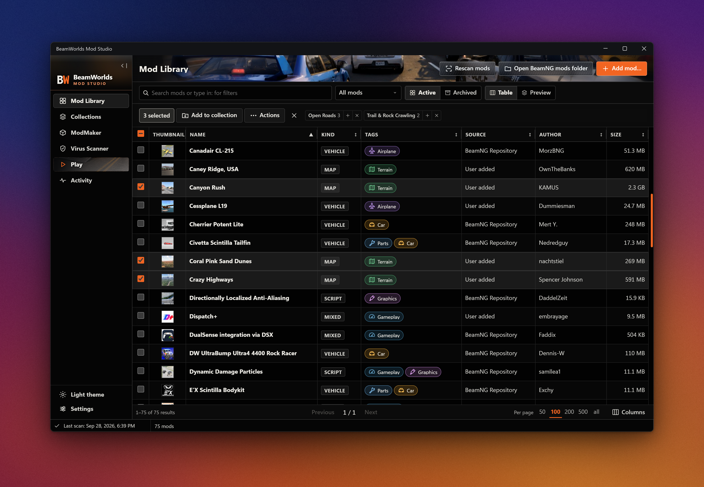

# BeamWorlds Mod Studio

**Run hundreds of BeamNG mods without the mess. Build new ones just by describing them.**

   [](LICENSE)

**[Downloads](#download-for-windows)** · [Website](https://beamworlds.b0rz.com) · [Report a problem](https://github.com/SignedAdam/beamworlds-mod-studio/issues)

BeamWorlds Mod Studio is a mod manager and mod workshop for BeamNG.drive. It keeps your library tidy, gets the right mods into the game fast, and comes with Virgil, an AI that builds, edits, and repairs mods for you.



## What it does

- **Your whole library in one place.** Browse, search, tag, and edit hundreds of mods, with previews. Duplicates get flagged so you can clean them up.
- **Finds every mod.** Studio picks up mods from the official BeamNG repository and the ones you downloaded elsewhere, like ModLand, whether they're ZIPs or unpacked folders. It also shows which ones came from the repository.
- **Fast.** Studio reads each mod once and remembers it. After the first scan, the library opens instantly and rescans skip anything that hasn't changed. **Play** links mods into the game instead of copying gigabytes around, whenever your drive supports it.
- **Collections and profiles.** Group mods into collections, save setups like *Friday drift night* or *clean career*, and switch between them in **Play**.
- **Make your own mods.** Describe the mod you want, like *"a police light bar for the D-Series,"* and Virgil builds it from scratch. Prefer to do it yourself? Start from a ready-to-load vehicle, map, UI app, or script and take it from there. New mods show up in your library like any other.
- **Change any mod by asking.** Tell Virgil what you want, and it makes the change.
- **Fix broken mods.** Console full of errors, or a mod that won't load? Virgil finds the cause in BeamNG's log, fixes it, and tests the fix in the game.
- **Edit by hand, safely.** ModMaker opens any mod for editing, including textures in BeamNG's DDS formats (BC1–BC5, BC7). Every saved version, including the original, stays one click away.
- **Virus Scanner.** Check mods for suspicious code locally, or let Virgil take a closer look.

## Meet Virgil

Virgil is the AI built into Studio. Describe what you want in plain words, and Virgil builds it: a brand-new mod (*"a drivable shopping cart that tops out at 40 km/h"*), a change to one you already have (*"add a turbo option to this car"*), or a fix (*"this mod floods my console with errors"*). No scripting, no digging through folders, no modding experience required.

**Anyone can make mods now. If you can describe it, you can build it.**

What makes Virgil different from pasting files into a chatbot:

- **It mods the BeamNG way.** Virgil is instructed to build mods the way [BeamNG's modding documentation](https://documentation.beamng.com/modding/) lays out: the right folders, names, and file formats, so its work loads cleanly next to your other mods. When it isn't sure how the game behaves, it reads the game's own code instead of guessing.
- **It tests before it says "done."** Virgil validates every change and reads BeamNG's error log. With BeamNG closed, it can start a private test session, spawn the mod, and let it run to make sure it holds up.
- **It can't wreck your library.** Virgil only touches the mod it's working on. Every change is saved as a version, and the original is one click away.

**Bring your own AI.** Sign in with the ChatGPT or Claude subscription you already have, or add an API key from OpenAI, Anthropic, or OpenRouter, which opens up hundreds of models from other AI labs.

## Coming soon

- **JBeam editor.** A dedicated editor for JBeam, the files that define how BeamNG vehicles are built and how they crumple.
- **Local AI models.** Run Virgil on your own computer. It will work, but we don't recommend it: mod work needs a strong model, and most local models aren't there yet.
- **No strings attached.** Some mods scramble their code so nobody can read it. Virgil will untangle it, so you can see what a mod really does, then fix or change it like any other.

## Download for Windows

Both packages contain the same app. Choose how you'd like to run it:

| Download | How to use it |
| --- | --- |
| [Installer (.exe)](https://github.com/SignedAdam/beamworlds-mod-studio/releases/latest/download/BeamWorldsModStudio-windows-amd64-installer.exe) | Run setup, then open **BeamWorlds Mod Studio** from the Start menu. |
| [Portable (.zip)](https://github.com/SignedAdam/beamworlds-mod-studio/releases/latest/download/BeamWorldsModStudio-windows-amd64.zip) | Extract the ZIP wherever you want to keep the app, then open **`beamngmodstudio.exe`**. No installation needed. |

## Getting started

1. **Connect your folders.** Close BeamNG and open Studio. Follow setup to select your game, user folder, and mod folders. Existing mods can stay where they are.
2. **Explore your library.** Let the first scan finish, then browse **Mod Library**. Use **Add mod…** to import more ZIPs or unpacked mod folders.
3. **Choose what to play.** Open **Play**, choose **All mods** or your **Collections**, and press **Play**. Save a profile to reuse that selection later.
4. **Make your own.** Open **ModMaker**, click **New mod**, and describe what you want to build, or choose **Set up manually** to start from a template.

Want Virgil? Connect your ChatGPT or Claude subscription, or an API key, under **Settings → Virgil**. Everything else works without AI.

## Help

[Report a problem or suggest a feature](https://github.com/SignedAdam/beamworlds-mod-studio/issues). Include what happened and any error message.

<details>
<summary>Setup and library tips</summary>

- **Can't find BeamNG?** Select the game folder containing `Bin64`. Use the BeamNG launcher to locate your existing user folder.
- **Missing WebView2?** Install the [Microsoft WebView2 Runtime](https://developer.microsoft.com/en-us/microsoft-edge/webview2/).
- **Game starts with the wrong renderer?** In **Play**, click the renderer line under the mod count (it reads **Default renderer (DX12)** at first) and choose **Default** (DirectX 12, falling back to DirectX 11, like the BeamNG launcher's main button), **Vulkan**, **DirectX 12** without fallback, or **DirectX 11**. Studio remembers the choice for every launch, including ModMaker game tests.
- **AI connections:** Virgil sends requests and relevant mod content to your selected provider. That provider's pricing and usage limits apply.

### Add existing mods

Configured folders are scanned automatically. **Add mod…** copies ZIPs or unpacked mod folders into your library without changing the originals. Use **Rescan mods** for files added outside Studio. Importing a mod doesn't enable it in the game; choose your mod set in **Play**.

### Unpacked mods

Every folder inside an `unpacked` folder, such as BeamNG's `mods/unpacked`, is one mod and shows an **Unpacked** badge. Studio uses these folders as they are: it never packs them into a ZIP and never looks inside them for more mods. Scans read only each folder's file list and its few info files, so a mod with thousands of files is checked in milliseconds; virus scans, opening in ModMaker, and importing read everything because you asked for it. **Play** links the selected unpacked mods into the game instead of copying them, and folders you unpack in game move back to your BeamNG `mods/unpacked` folder when it closes.

### Edited mods and versions

Opening a mod in **ModMaker** edits that mod. When you or Virgil save a change, Studio updates the mod in your library a few seconds later. It keeps its name, collections, and file name, and **Play** picks it up automatically. For an unpacked mod, only the changed files are written into its folder, and changes made there outside Studio (for example by BeamNG's World Editor) are kept and appear in ModMaker. The library shows edited mods with an **Edited** badge. **Versions** (in ModMaker, or the mod's **Versions** tab in **Mod Library**) lists each saved state and the original, and **Restore** returns to any of them. Your current state is kept, so a restore can be undone. Changes wait while BeamNG is running. Mods in BeamNG's own repository folder are never rewritten; their changes stay in ModMaker, and **Export** saves a copy.

### Table controls

Use checkboxes to select mods, Ctrl-click to toggle a selection, and Shift-click to select a range. Right-click for available actions. **Columns** lets you choose and reorder the columns you see.

</details>

## Technical details

<details>
<summary>Build from source, run tests, and package</summary>

Go + Wails v3, React + TypeScript, and SQLite. The desktop app lives in `studio/BeamNGModStudio`; mod reading and editing tools live in `modkit`, where `modkit.Source` is the one place that knows whether a mod is a ZIP or an unpacked folder.

### Build

On Windows, install **Go 1.25+**, **Node.js 20+**, **Git**, and **WebView2**. Keep Go's automatic toolchain selection enabled. In PowerShell:

```powershell
git clone https://github.com/SignedAdam/beamworlds-mod-studio.git
cd beamworlds-mod-studio
go install github.com/wailsapp/wails/v3/cmd/wails3@v3.0.0-beta.16
$env:PATH = "$(go env GOPATH)\bin;$env:PATH"
cd studio/BeamNGModStudio
wails3 build
```

The build downloads frontend dependencies and the checksum-pinned AI runtime. Output: `studio/BeamNGModStudio/bin/beamngmodstudio.exe`.

### Tests

After building, from the repository root:

```powershell
go -C modkit test ./...
go -C studio/BeamNGModStudio test ./...
```

Set `BEAMWORLDS_HOME` to a separate folder for isolated app configuration. Folders selected in setup are still real filesystem locations.

### Packaging

Install [NSIS](https://nsis.sourceforge.io/) on `PATH`. From `studio/BeamNGModStudio`, after building:

```powershell
node build/collect-notices.mjs
powershell -File build/windows/package-release.ps1
wails3 task windows:package
```

The [release workflow](.github/workflows/release.yml) builds an existing tag and creates a draft release with downloads and checksums.

### Safety model

Scanning reads library mods in place. Saving in ModMaker rebuilds a ZIP mod's file, or writes only the changed files of an unpacked mod; Studio first keeps the original (for unpacked mods, just the files it changes) in its data folder, along with every saved version, until you delete the ModMaker project. Play applies the selected mod set and links unpacked mods rather than copying them; removing a link never touches the mod's own files. Profiles themselves don't change mod files.

If a scan can't read a library folder (an unplugged drive, an offline share, denied access), the mods in it keep their place in the library and in collections, and the status bar names the folder until a scan reaches it again.

</details>

## License

[GNU GPL version 3 only](LICENSE). Third-party components retain their own licenses. The BeamWorlds name and logo aren't covered by the code license.

An independent project, not an official BeamNG product.
